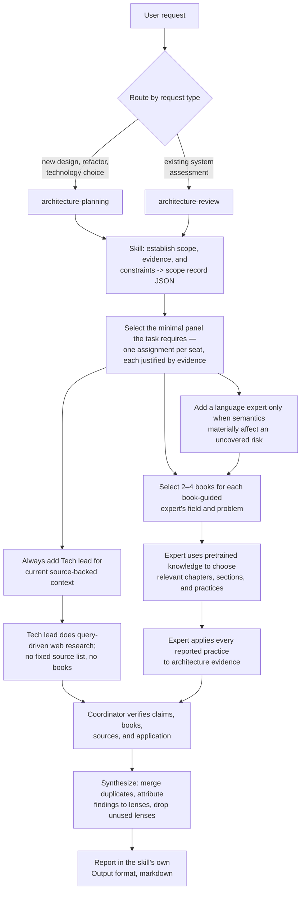

# Code Architect workflow

Both skills run the same flow; only scope, expert analysis, final verification,
and report format differ. Every agent returns structured JSON against a
contract; the coordinator's final answer is the only markdown.

## Shared expert execution

After scope and panel selection, both skills run these seven steps in order.
Each rule stands on its own line.

### 1. Start every expert in isolation

- Start each expert as a fresh subagent whose context does not inherit this
  conversation, never as a fork of it, and provide only the inputs named in
  these steps.
- If the platform cannot start fresh subagents, stop. Do not simulate an
  expert or fork one from coordinator or Librarian history. Once the panel runs
  this way, record `execution_mode` as `agents` in the scope record.
- Isolation here means conversation isolation. Experts can read the plugin's
  own files, so the protection is that no coordinator or Librarian history is
  ever placed in an expert's prompt.
- Give every expert the same scope and evidence in an assignment whose
  `output_contract` the skill selects.
- The mandatory [Tech lead](agents/tech-lead.md) receives
  `tech-lead-current-brief.json`. Every book-guided expert receives the
  invoking skill's expert contract and follows the
  [shared expert protocol](agents/expert-protocol.md).

### 2. Run the Tech lead

Continue the Tech lead in its isolated context.

- It uses available web-search tools to find current technical sources by
  query relevance, authority, recency, and depth.
- Do not hardcode or require a fixed source list. Official engineering blogs,
  standards, preprints, issue trackers, public technical discussions, Hacker
  News, and X threads are examples of source shapes, not an allowlist.
- It does not request books, use the Librarian, cite unsupported current
  claims, or write recommendations. It returns source-backed insights,
  technology signals, and tradeoffs; the coordinator owns final
  recommendations.
- It must return at least one source note, one insight, one technology
  signal, and one tradeoff.
- Every source note must include a date, version, commit, or `not stated`.
- If web search is unavailable or no relevant source can be found, treat the
  Tech lead step as blocked. Never accept a source-free brief.

### 3. Select books through the Librarian

Start one isolated shared [Librarian](agents/librarian.md). The coordinator
sits between every expert and the Librarian.

- Each book-guided expert sends its book request to the coordinator. The
  coordinator relays it to the Librarian and receives the response. Never
  allow direct expert-Librarian messaging.
- Each request is matched to both the expert's expertise and the concrete
  architecture problem.
- The Librarian returns two to four exact editions with fit reasons, and
  nothing else: no verification sources, section names, summaries,
  principles, excerpts, or analysis.
- The Librarian accepts a book only through its private familiarity gate: it
  recognizes the exact title, author, and edition from pretrained knowledge
  and recalls at least three distinctive book-specific ideas. It rejects
  uncertainty and never exposes the check, its confidence, the recalled
  ideas, or training-data claims. Treat the gate as a familiarity filter,
  not proof of training-set membership, because models cannot inspect their
  training corpus.
- A replacement request, sent when an expert rejects a book, carries
  `request_kind: replacement` and every rejected book in `excluded_books`. The
  Librarian returns exactly one book and never one listed there.

The book-list response goes only to the coordinator. Validate every list
before use:

- If the response is `insufficient_familiar_books`, do not forward it. Revise
  the assignment or stop and ask the user.
- Reject blank, vague, or duplicate metadata.
- Independently confirm each exact title, author, and edition against
  official author or publisher material before forwarding the list.
- Reject and retry any fit or rationale that exposes confidence, familiarity
  checks, recalled material, training-data claims, or named or paraphrased
  book-specific content.
- Require `role`, `architecture_problem`, and `request_kind` to exactly equal
  the original book request. Reject the record if any differs, so those fields
  cannot carry hidden Librarian content.
- Never forward the raw Librarian record. Rebuild a clean book-list record
  from the original request fields, the verified identity, and the validated
  `expertise_fit`, `problem_fit`, and `selection_rationale` fields.
- Sort books by exact title, then author, then edition, and assign sequential
  ids `b1` through `bN` in the coordinator, so Librarian-supplied order and
  ids cannot become covert channels.
- For a replacement, merge the one returned book into the expert's accepted
  books, then rebuild, sort, and re-id the full list before forwarding it. If
  the Librarian returns `insufficient_familiar_books` for a replacement and the
  expert would keep fewer than two books, revise the assignment or stop and
  ask the user.

### 4. Hand the validated list to the expert

Continue each book-guided expert in the isolated context started in step 1.

- That context may contain only the expert definition, the protocol, the
  assignment, and the coordinator-validated book list.
- Exclude coordinator history, Librarian instructions, raw or unvalidated
  Librarian responses, the private familiarity gate, and other experts'
  contexts.
- Instruct the expert explicitly to use its pretrained knowledge of the
  selected books. Do not search for, download, or require book copies.

### 5. Experts choose chapters and apply practices

- Each book-guided expert chooses relevant chapters and sections from its own
  field and the concrete architecture problem.
- Every reported chapter must name at least one section and contribute at
  least one practice applied to concrete architecture evidence.
- If the expert cannot confidently recall a relevant practice and its
  location, it rejects that book and requests one replacement, naming every
  book it has rejected so far in `excluded_books`.

### 6. Collect and validate every response

- Have every expert complete its JSON before synthesis.
- Validate every response against the assignment's output contract.
- Reject source claims, chapter names, sections, practices, or applications
  that are vague, internally inconsistent, or unsupported.
- For Tech lead briefs, also reject any `source_ids` value that does not
  match a real `source_notes[].id`.

### 7. Verify and record

Record every check in a
[verification record](contracts/verification-record.json).

Books:

- For every book, independently find official author or publisher material
  and confirm its exact title, author, and edition.
- Verify the chapter structure and each chapter-practice association using
  official author or publisher material when available, otherwise reliable
  public bibliographic or preview material. This never limits selection to
  free books and never requires a complete copy.
- Verify that every stated application follows from the architecture
  evidence.
- Confirm or reject an entry; never rewrite it or invent an application.
- Retry an unverifiable entry once, then remove its authority and record why.
- Describe the result as verified book-grounded use of pretrained knowledge,
  not runtime reading or proof of training-set membership.

Tech lead sources:

- For every source used in the report, verify the URL, the source date or
  version when exposed, its relevance to the architecture question, and how
  each insight, technology signal, or tradeoff applies to the concrete
  evidence.

Standards conformance:

- For every `standards_conformance` entry, open the named standard at its URL
  and confirm the cited clause exists and supports the verdict. Reject an entry
  whose clause cannot be found.

Production proof:

- For each major recommendation, option, or evolution step, record a
  production-proof assessment: `direction` when architecture or sources
  support it, `provider` when the target provider supports it without a run,
  or `operational` only when a real command, test, deploy, or drill proved it.
- Name the missing proof and the next smallest delegated proof spec.
- Describe that proof as validation work for the owning team: owner,
  acceptance evidence, observations to capture, and pass/fail conditions.
- Do not turn proof specs into backlog work such as building adapters,
  writing fixtures, adding tests, creating manifests, running deployments, or
  implementing proof harnesses unless the user separately asks for execution.

## Contracts

Each output is a JSON Schema in [contracts/](contracts/). The shared expert
protocol declares expert contracts; the Librarian declares its own interface.
Each agent sees only those contracts. The invoking skill chooses the expert
output contract.

Before using any book list, expert response, or verification record, the
coordinator checks it against the named contract and returns invalid JSON to
its producer for correction. A plausible shorthand is not a contract-valid
record. Verification may confirm or reject expert evidence; the coordinator
never substitutes its own book practices or applications.

| Contract | Producer | Consumer | Used by |
|----------|----------|----------|---------|
| [contracts/scope.json](contracts/scope.json) | coordinator | coordinator (audit record) | both skills |
| [contracts/expert-assignment.json](contracts/expert-assignment.json) | coordinator | each expert | both skills |
| [contracts/book-request.json](contracts/book-request.json) | each book-guided expert | Librarian, relayed by the coordinator | both skills |
| [contracts/book-list.json](contracts/book-list.json) | Librarian | coordinator; requesting expert only after identity validation | both skills |
| [contracts/tech-lead-current-brief.json](contracts/tech-lead-current-brief.json) | Tech lead | coordinator | both skills |
| [contracts/expert-planning-proposal.json](contracts/expert-planning-proposal.json) | each book-guided expert | coordinator | architecture-planning |
| [contracts/expert-review-analysis.json](contracts/expert-review-analysis.json) | each book-guided expert | coordinator | architecture-review |
| [contracts/verification-record.json](contracts/verification-record.json) | coordinator | coordinator (audit record) | both skills |

Programming-language experts use the invoking skill's expert contract with
their language as `role` (for example `"role": "language:typescript"`).
The Tech lead uses only `tech-lead-current-brief.json` with `"role":
"tech-lead"`.

The scope record grounds every seat justification and the report's context.
The expert contracts record chapter and section locations plus practice
application. The tech lead contract records current sources plus the insights,
technology signals, and tradeoffs they shaped. The verification record is where
each book identity, source, reported item, application, and production-proof
assessment earns its confirmed entry.

## Report — coordinator to user

The coordinator consumes the expert JSON, verifies it, and writes the
user-facing report in the invoking skill's own `Output` section as markdown
prose. Expert JSON stays internal working data.

- Attribute every finding and upheld practice to the lens that produced it.
- Report each book's chapters and sections used, practices applied,
  source-backed Tech lead insights, technology signals, and tradeoffs used,
  and verification verdict.
- List the Tech lead `source_notes` first in the current-source trace so the
  report has an explicit source list.
- If the user requests specific questions, headings, score names, or
  ordering, preserve that shape and answer each item directly; do not replace
  it with the template's generic headings.
- Separate architecture direction from production proof: include confidence,
  evidence, missing proof, and the next smallest delegated proof spec for
  each major recommendation.
