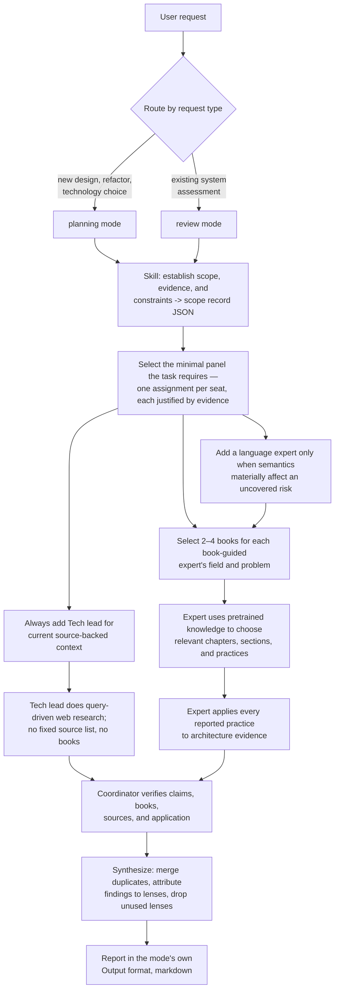

# Code Architect workflow

Both modes run the same flow; only scope inputs, the expert output contract,
mode-specific verification, and report format differ. Every agent returns
structured JSON against a contract; the coordinator's final answer is the only
markdown. Paths in this file are relative to the `references/` folder that
contains it.

## Scope and panel

Read this file and the [expert index](agents/index.md) before anything else.
Each expert's own definition and the protocol go into that expert's prompt in
step 1; you do not need them in your own context to select the panel.

- Establish scope as the selected mode directs and record it as a
  [scope record](contracts/scope.json). State material unknowns instead of
  inventing facts.
- Select the minimal book-guided panel the task requires from the index. Seat
  a lens only with specific evidence from the scope, recorded in that expert's
  assignment `justification`. Always seat the Tech lead; it is a standing seat
  and carries no justification.
- Identify every materially involved language or DSL, judging by content, and
  record each one's evidence and seating decision in the scope record's
  `languages`. Seat a programming-language expert only when language semantics
  materially affect a risk the seated experts do not cover; a runtime, schema,
  or file format appearing in the scope is not enough. Give each seated
  language expert an explicit watch list, and let one expert also cover a
  closely coupled framework when that keeps the panel smaller.

## Shared expert execution

After scope and panel selection, both modes run these seven steps. Step 2 and
steps 3–5 are independent branches: run them concurrently and join at step 6.

### 1. Start every expert in isolation

- Start each expert as a fresh subagent whose context does not inherit this
  conversation, never as a fork of it, and provide only the inputs named in
  these steps.
- If the platform cannot start fresh subagents, stop. Do not simulate an
  expert or fork one from coordinator or Librarian history. Once the panel runs
  this way, record `execution_mode` as `agents` in the scope record.
- Isolation here means conversation isolation. Experts can read the plugin's
  own files, so the protection is that no coordinator or Librarian history is
  ever placed in an expert's prompt.
- Give every expert the same scope and evidence in an
  [assignment](contracts/expert-assignment.json) whose `output_contract` the
  selected mode selects. Resolve `output_contract` from this `references/`
  directory and pass the resolved contract with the assignment, so an isolated
  expert can read it without guessing a working directory. The Tech lead's is
  [contracts/tech-lead-current-brief.json](contracts/tech-lead-current-brief.json).

### 2. Run the Tech lead

The [Tech lead](agents/tech-lead.md) researches in the context started in
step 1 while steps 3–5 run; its definition holds its rules and its contract
holds the required shape. If it reports that web search is unavailable or that
no relevant source exists, the step is blocked: never accept a source-free
brief.

### 3. Select books through the Librarian

Start one isolated shared [Librarian](agents/librarian.md); its definition
holds the selection rules and the private familiarity gate. The coordinator
sits between every expert and the Librarian.

- Each book-guided expert sends its [book request](contracts/book-request.json)
  to the coordinator, which relays it to the Librarian and receives the
  response. Never allow direct expert–Librarian messaging. Initial requests
  may travel together in one Librarian call; each gets its own book-list
  record.

The [book-list](contracts/book-list.json) response goes only to the
coordinator. Validate every list before use:

- If the response is `insufficient_familiar_books`, do not forward it. Revise
  the assignment or stop and ask the user.
- Reject blank, vague, or duplicate metadata.
- Confirm each exact title, author, and edition against official author or
  publisher material, once per distinct edition per run; reuse the result for
  every expert that received the same book. Keep the verdict and method: they
  become that book's `identity` entry in the verification record, and step 7
  does not repeat the lookup.
- Reject and retry any fit or rationale that exposes confidence, familiarity
  checks, recalled material, training-data claims, or named or paraphrased
  book-specific content.
- Require `role`, `architecture_problem`, and `request_kind` to exactly equal
  the original book request. Reject the record if any differs, so those fields
  cannot carry hidden Librarian content.
- Never forward the raw Librarian record. Rebuild a clean book-list record
  from the original request fields, the verified identity, and the validated
  `expertise_fit`, `problem_fit`, and `selection_rationale` fields.
- Sort books by exact title, then author, then edition, and assign sequential
  ids `b1` through `bN` in the coordinator, so Librarian-supplied order and
  ids cannot become covert channels.
- For a replacement, merge the one returned book into the expert's accepted
  books, then rebuild, sort, and re-id the full list before forwarding it. If
  the Librarian returns `insufficient_familiar_books` for a replacement and the
  expert would keep fewer than two books, revise the assignment or stop and
  ask the user.

### 4. Hand the validated list to the expert

Continue each book-guided expert in the isolated context started in step 1.

- That context may contain only the expert definition, the
  [shared expert protocol](agents/expert-protocol.md), the assignment, and
  the coordinator-validated book list, each by content or by path.
- Exclude coordinator history, Librarian instructions, raw or unvalidated
  Librarian responses, the private familiarity gate, and other experts'
  contexts.
- Instruct the expert explicitly to use its pretrained knowledge of the
  selected books. Do not search for, download, or require book copies.

### 5. Experts choose chapters and apply practices

Each expert follows the protocol: it chooses chapters and sections from its
own field and the concrete architecture problem, applies at least one practice
per reported chapter to architecture evidence, and rejects a book it cannot
confidently recall a relevant practice for by sending a `replacement` request
through step 3.

### 6. Collect and validate every response

- Have every expert complete its JSON before synthesis.
- Validate every response once, when it arrives, against the assignment's
  output contract, and return invalid JSON to its producer for correction. A
  plausible shorthand is not a contract-valid record.
- Reject source claims, chapter names, sections, practices, or applications
  that are vague, internally inconsistent, or unsupported.
- For Tech lead briefs, also reject any `source_ids` value that does not
  match a real `source_notes[].id`.

### 7. Verify and record

Record every check in a
[verification record](contracts/verification-record.json). Verification
confirms or rejects expert evidence; the coordinator never substitutes its own
book practices or applications.

Books:

- Confirm that every `book_practices` entry's `book_id`, `title`, and
  `edition` equal the forwarded list; identity itself was verified and
  recorded in step 3.
- Verify the chapter structure and each chapter-practice association using
  official author or publisher material when available, otherwise reliable
  public bibliographic or preview material. Fetch a book's table of contents
  once per run, not once per expert or per practice. This never limits
  selection to free books and never requires a complete copy.
- Verify that every stated application follows from the architecture
  evidence.
- Confirm or reject an entry; never rewrite it or invent an application.
- Retry an unverifiable entry once, then remove its authority and record why.
- Describe the result as verified book-grounded use of pretrained knowledge,
  not runtime reading or proof of training-set membership.

External sources:

- For every URL that reaches the report — each Tech lead source used and each
  standard cited in `standards_conformance` — open it once per distinct URL
  and record a `source_checks` entry: the source date or version when exposed,
  its relevance to the architecture question, and how each insight, technology
  signal, tradeoff, or conformance verdict applies to the concrete evidence.
  For a standard, confirm the cited clause exists and supports the verdict,
  and reject an entry whose clause cannot be found. Skip the fetch for
  `not_applicable` entries.

Production proof:

- Record a `proof_assessments` entry for each major recommendation, option,
  or evolution step, using the confidence levels and proof-spec fields the
  contract defines.
- Do not turn proof specs into backlog work such as building adapters,
  writing fixtures, adding tests, creating manifests, running deployments, or
  implementing proof harnesses unless the user separately asks for execution.

## Contracts

Each output is a JSON Schema in [contracts/](contracts/). Each agent sees only
the contracts its interface names; the selected mode chooses the expert output
contract. Every `role` value is a role id from the
[expert index](agents/index.md): a lens id such as `systems`,
`language:<name>` for a programming-language expert, or `tech-lead`.

| Contract | Producer | Consumer | Used by |
|----------|----------|----------|---------|
| [contracts/scope.json](contracts/scope.json) | coordinator | coordinator (audit record) | both modes |
| [contracts/expert-assignment.json](contracts/expert-assignment.json) | coordinator | each expert | both modes |
| [contracts/book-request.json](contracts/book-request.json) | each book-guided expert | Librarian, relayed by the coordinator | both modes |
| [contracts/book-list.json](contracts/book-list.json) | Librarian | coordinator; requesting expert only after identity validation | both modes |
| [contracts/tech-lead-current-brief.json](contracts/tech-lead-current-brief.json) | Tech lead | coordinator | both modes |
| [contracts/expert-planning-proposal.json](contracts/expert-planning-proposal.json) | each book-guided expert | coordinator | planning mode |
| [contracts/expert-review-analysis.json](contracts/expert-review-analysis.json) | each book-guided expert | coordinator | review mode |
| [contracts/shared-definitions.json](contracts/shared-definitions.json) | — | the two expert contracts `$ref` its `book_practices` and `standards_conformance`; read it with them | both modes |
| [contracts/verification-record.json](contracts/verification-record.json) | coordinator | coordinator (audit record) | both modes |

The scope record grounds every seat justification and the report's context.
The expert contracts record chapter and section locations plus practice
application. The Tech lead contract records current sources plus the insights,
technology signals, and tradeoffs they shaped. The verification record is where
each book identity, source, reported item, application, and production-proof
assessment earns its confirmed entry.

## Report — coordinator to user

The coordinator consumes the expert JSON, verifies it, and writes the
user-facing report as markdown prose; expert JSON stays internal working data.
Merge duplicate concerns across lenses, preserve useful practices, make
tradeoffs explicit, and write the final recommendations yourself. If the user
requested specific questions, headings, score names, or ordering, preserve that
shape and answer each item directly instead of using the generic headings.

Every report opens with these shared sections, then continues with the
selected mode's own `Output` sections:

- Panel: the seated experts and one line on why each was included; lenses
  excluded at selection and experts dropped at synthesis, each with its
  reason. An expert whose analysis produced nothing the report uses moves from
  the seated panel to the dropped list. Attribute every finding and upheld
  practice to the lens that produced it, holding both to the same evidence
  bar.
- Book-practice trace: selected books, why each fit, verified chapters and
  sections used, practices applied, the architecture evidence and output each
  practice shaped, and verdicts.
- Source list and current-source trace: Tech lead `source_notes` first, then
  why each source was relevant, the insights, technology signals, tradeoffs,
  and architecture evidence each shaped, and verification verdicts.
- Standards conformance, when the AI lens is seated: each standard checked,
  the artifact, the clause, the verdict, and the evidence.
- Production proof, kept separate from architecture direction: for each major
  recommendation, its `proof_assessments` entry — confidence, evidence, missing
  proof, and the next smallest delegated proof spec.
