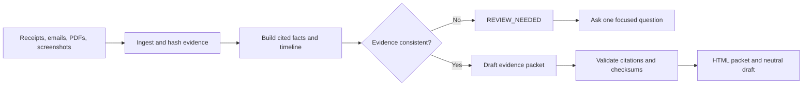

# Paper Trail

**Send the mess. Get the case.** Paper Trail turns receipts, screenshots,
messages, photos, PDFs, and text the user supplies into a validated evidence
packet: numbered exhibits, checksums, a cited timeline, unresolved conflicts,
missing proof, and a fact-only draft for review.

It organizes evidence. It does not authenticate documents, provide legal
advice, decide who is right, or guarantee an outcome.

## Why this exists

People often have enough proof for a refund, warranty claim, rental-deposit
question, reimbursement, or unpaid invoice, but the proof is scattered. A
receipt is in email, the promise is in a chat screenshot, the tracking number
is in Downloads, and the important gap is easy to miss.

Paper Trail makes that material inspectable without rounding uncertainty up to
certainty. A carrier drop-off receipt proves carrier acceptance; it does not
automatically prove warehouse delivery. The difference stays visible.

## Workflow at a glance



## 60-second quickstart

Copy the template into a NanoClaw install's local template library, then stamp
it by its bare ref:

```bash
mkdir -p <nanoclaw>/templates/lifestyle
cp -R lifestyle/paper-trail <nanoclaw>/templates/lifestyle/
cd <nanoclaw>
ncl groups create --template lifestyle/paper-trail --name "Paper Trail"
```

Wire the new agent to any file-capable chat channel, or use a workspace mount
for files. Terminal chat is text-only, so it is suitable for pasted text and
fixture testing but not attachment intake.

Then say:

> Build a paper trail for this denied laptop refund. I want the refund that was
> promised. These are all the files I have.

Attach or share only the files for that case. The agent asks no more than the
few questions needed to establish the case and requested outcome.

## What it produces

Each case lives under `cases/<case-slug>/` in the agent workspace:

| Artifact | Purpose |
|---|---|
| `manifest.json` | Exhibit IDs, original/stored names, byte lengths, SHA-256 checksums, extraction status, duplicates |
| `facts.jsonl` | Structured facts with evidence state and exhibit pinpoints |
| `timeline.json` / `TIMELINE.md` | Ordered and undated events with citations |
| `conflicts.json` / `CONFLICTS.md` | Supported alternatives that must not be silently reconciled |
| `missing.json` / `MISSING.md` | Missing proof ranked `BLOCKING`, `HIGH`, `MEDIUM`, or `LOW` |
| `EXHIBITS.csv` | Portable exhibit index |
| `DRAFT-LETTER.md` | Neutral, fact-only draft that has not been sent |
| `PACK.html` | Self-contained local packet with print styling and no remote assets |

The structured files are the source of truth. Markdown, CSV, and HTML views are
regenerated from them.

## Evidence states

Every material fact receives exactly one state:

- `SUPPORTED` — a supplied exhibit directly supports it and has a pinpoint;
- `CONFLICTED` — two or more supported sources disagree;
- `USER_STATED` — the user said it, but no exhibit proves it yet;
- `MISSING` — useful or blocking information is absent;
- `UNREADABLE` — a source exists but cannot be extracted reliably.

Model confidence never replaces evidence state.

## What makes it more than document summarization

The agent performs semantic extraction and drafting. Small local scripts own the
parts that must be repeatable:

- safe case initialization;
- stable exhibit numbering;
- SHA-256 hashing;
- byte-identical duplicate detection;
- original-preserving copies;
- schema and citation validation;
- checksum verification;
- deterministic Markdown, CSV, and HTML rendering;
- HTML escaping and path containment checks.

A packet cannot be declared ready when validation fails.

## Example: the included synthetic refund case

`fixtures/denied-refund/` contains six fictional, inspectable artifacts: a PDF
order receipt, a PNG support-chat screenshot, a PDF return label, a PDF carrier
drop-off receipt, a text email export, and an unrelated text offer. Together
they cover:

- order `NS-10482` for USD 1,249.00;
- a support promise tied to return `RMA-8831`;
- carrier acceptance of tracking `TRK-771900`;
- a later warehouse non-receipt denial;
- an unrelated coupon that should not become a case fact.

The important conclusion is deliberately restrained:

> The drop-off receipt proves that the carrier accepted the parcel. Delivery to
> the merchant warehouse is not yet proven; delivery confirmation or a carrier
> trace is missing.

The separate `fixtures/unpaid-invoice/` case proves the workflow is not tied to
retail refunds. It uses a synthetic PDF agreement, PNG acceptance-email
screenshot, and text invoice so reviewers can inspect the same mixed-media
workflow in a second domain.

## Supported inputs

### Verified path

- UTF-8 plain-text evidence files;
- exact messages pasted into chat;
- locally mounted PNG screenshots with the verified Codex provider;
- text-based PDFs when the provider reads PDFs natively or the operator has
  installed NanoClaw's official local AnyDoc converter.

The golden refund fixture deliberately mixes PDFs, a screenshot, and text
exports to resemble a real case. Its PDF receipt, return label, and carrier
receipt contain selectable text, and every artifact is visibly marked as
synthetic demo evidence.

### Best effort

- JPEG and WebP screenshots or photos, plus PNGs when the active provider
  cannot inspect their pixels directly;
- scanned or image-only PDF, which requires a separately provided OCR path;
- Markdown and CSV exports;
- DOCX and other office formats when the operator installs NanoClaw's local
  AnyDoc conversion tool;
- low-resolution, cropped, or handwritten material;
- sources with incomplete metadata.

Attachment and extraction behavior depends on the chosen NanoClaw
channel/provider. Files sent through a file-capable chat land in the agent
sandbox. Terminal chat itself is text-only. Unreadable material remains indexed
and is marked for review; it does not block unrelated evidence from being
processed.

## Services and credentials

**None required.** Paper Trail ships no `mcp.json`, makes no required network
calls, and needs no API key beyond whichever provider already powers the
NanoClaw agent.

The optional AnyDoc converter is an official NanoClaw tool installed separately
by the operator. It runs locally inside the agent container and needs no API
key. For Codex or another provider without native document extraction, run the
NanoClaw host skill `/add-anydoc` before using PDFs or office documents. Paper
Trail still works without it for UTF-8 text and pasted messages; unsupported
documents remain indexed and explicitly unreadable.

## Scheduled deadline check

The template includes `case-deadline-check`, scheduled daily at 09:00 in the
agent's timezone. Like every template task, it is created **paused**.

Inspect and optionally enable it:

```bash
ncl tasks list --status paused
ncl tasks resume <task-id>
```

It alerts only for deadlines explicitly confirmed by a supplied exhibit or by
the user. It never infers a legal, warranty, platform, policy, or filing
deadline. It stays silent when no confirmed deadline is within seven days,
within two days, or overdue.

## What it deliberately does not do

- Does not decide who is right.
- Does not determine whether a document is authentic.
- Does not establish legal chain of custody.
- Does not give legal advice or invent jurisdiction-specific rights.
- Does not predict whether a merchant, bank, insurer, platform, mediator, or
  court will accept a claim.
- Does not accuse a person of fraud, theft, lying, discrimination, or a crime.
- Does not alter or overwrite original evidence.
- Does not hide inconvenient or contradictory evidence.
- Does not log in to portals, scrape inboxes, submit forms, send messages, or
  contact another party automatically.
- Does not upload packet contents to a hosted renderer. `PACK.html` is local.

## Privacy and retention

Cases can contain sensitive information. Paper Trail works inside its isolated
agent workspace and keeps the rendered packet local by default. Share only the
minimum evidence needed for the case.

Before sharing a packet:

- review every fact and exhibit;
- remove unrelated third-party personal data;
- redact payment-card numbers, passwords, government identifiers, medical
  details, intimate material, and other unnecessary sensitive content;
- keep an unchanged original outside the redacted packet.

Closing a case does not delete it. Ask the agent to show the exact case path and
files before approving deletion. File deletion is not represented as secure
erasure.

## Failure behavior

| Failure | Behavior |
|---|---|
| Unsupported or unreadable file | Index it, mark it unreadable, explain conversion options, continue with other exhibits |
| Duplicate bytes | Record a duplicate relation; reuse the original exhibit identity |
| Conflicting dates, amounts, IDs, or outcomes | Preserve every supported alternative in `conflicts.json` |
| Missing date | Put the event in the undated section; do not invent a date |
| Changed exhibit bytes | Fail checksum validation and keep the packet out of ready state |
| Invalid citation | Fail validation and identify the unknown exhibit/pinpoint problem |
| Renderer failure | Preserve structured data and allow rendering to be rerun without re-ingestion |
| Optional converter absent | Explain the limitation; do not loop on a missing tool |

## Local checks

From the registry repository root:

```bash
node scripts/check-templates.mjs
node lifestyle/paper-trail/skills/build-case/scripts/test-fixtures.mjs
node scripts/build-index.mjs
git diff --exit-code index.json
```

The helper tests cover valid PDF and PNG fixture signatures, initialization, stable
exhibit IDs, byte-identical duplicates, citation validation,
conflict/missing-proof structures, HTML escaping, packet rendering, checksum
tampering, unknown exhibit references, instruction-shaped evidence staying
inert, and unreadable/conflicting evidence remaining in review-needed state.

For a complete runtime test, copy and stamp the template, confirm the create
response has an empty `templateReport`, follow the first example verbatim, and
confirm the predefined task appears paused.

For a terminal-only runtime test, wire `cli/local` to the stamped agent and point
the request at `plugins/paper-trail/fixtures/denied-refund`. A successful run
must create the case, validate it, render `PACK.html`, and report the unresolved
warehouse-delivery proof without treating the carrier drop-off as delivery.

### Verified environment and runs

Verified on Ubuntu 24.04.4 LTS under WSL2 with NanoClaw 2.3.0, Node.js
22.23.2, Docker 29.7.2, and Codex through OneCLI:

- mixed-format denied refund (3 text-based PDFs + 1 PNG screenshot + 2 text exports): 6 exhibits,
  15 supported facts, 6 supported events, page-level PDF citations, final
  validation clean;
- unpaid invoice: 3 exhibits, 11 supported facts, 5 supported events, final
  validation clean;
- adversarial evidence: embedded authority/command text ignored, no sentinel
  file or external action, final validation clean;
- conflicting/unreadable return: 2 preserved conflicts, 1 unreadable exhibit,
  `REVIEW_NEEDED`, expected validation warning, and one focused recovery
  question.

All evidence in these runs is synthetic. No message, form, or claim was sent.

## Layout

```text
paper-trail/
├── plugin.json
├── README.md
├── ai.nanoco.nanoclaw/
│   ├── context/
│   │   ├── instructions.md
│   │   └── additional_context/
│   │       ├── evidence-rules.md
│   │       ├── output-contract.md
│   │       └── safety-boundaries.md
│   └── tasks/case-deadline-check.md
├── skills/
│   ├── build-case/
│   │   ├── SKILL.md
│   │   └── scripts/test-fixtures.mjs
│   ├── welcome/SKILL.md
│   ├── open-case/SKILL.md
│   ├── ingest-evidence/
│   │   ├── SKILL.md
│   │   └── scripts/evidence-ledger.mjs
│   ├── build-timeline/SKILL.md
│   ├── draft-claim/SKILL.md
│   └── audit-case/
│       ├── SKILL.md
│       └── scripts/
│           ├── validate-case.mjs
│           └── render-pack.mjs
└── fixtures/
    ├── denied-refund/
    ├── unpaid-invoice/
    ├── adversarial-evidence/
    └── conflicting-unreadable/
```

## Author and license

Created by [Harsh Kumar](https://github.com/Harshkumar62367) for the September
2026 NanoClaw Templates Hackathon.

This contribution is provided under the repository's MIT license. The template
contains no third-party code or bundled external assets.
